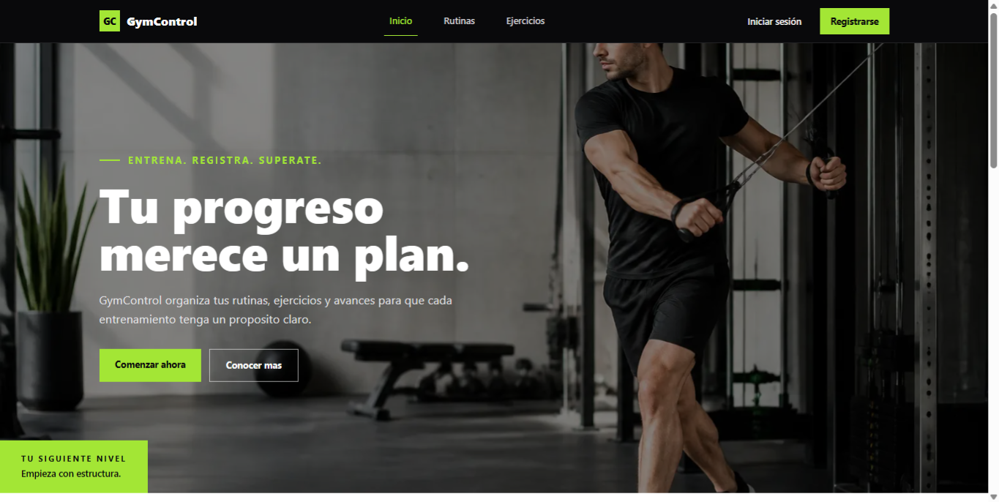
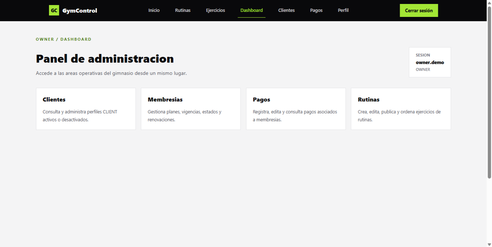
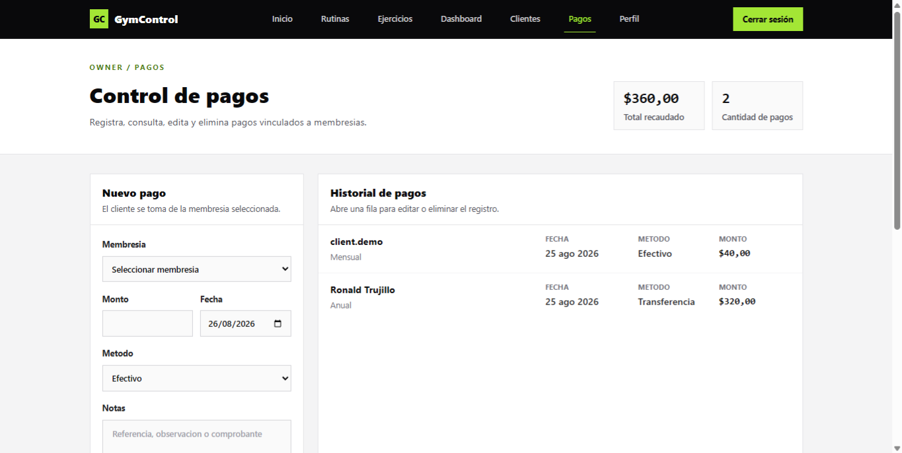
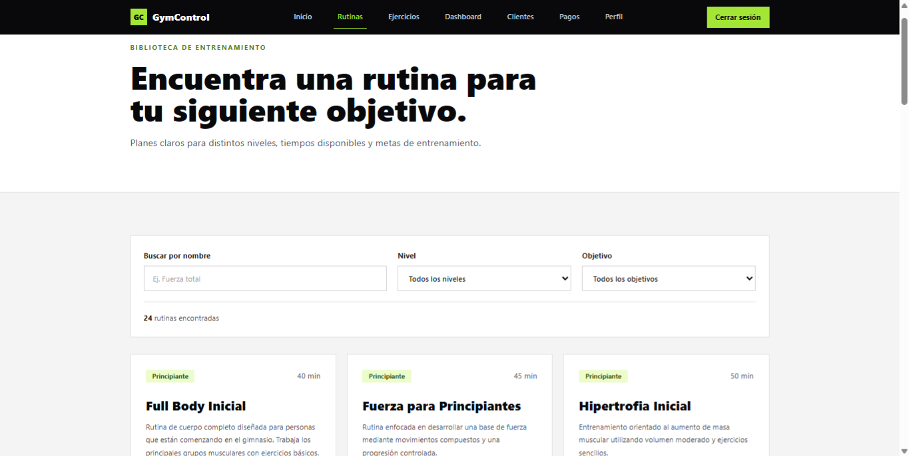
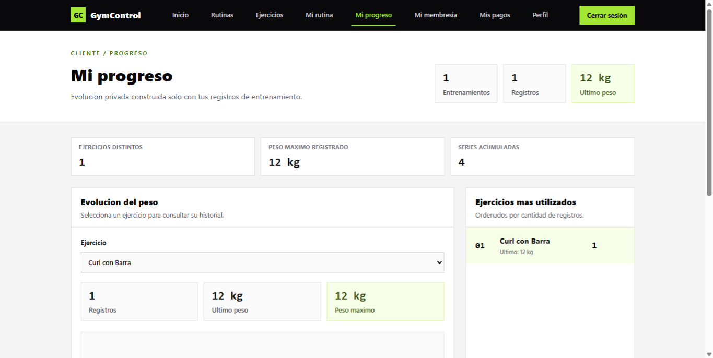
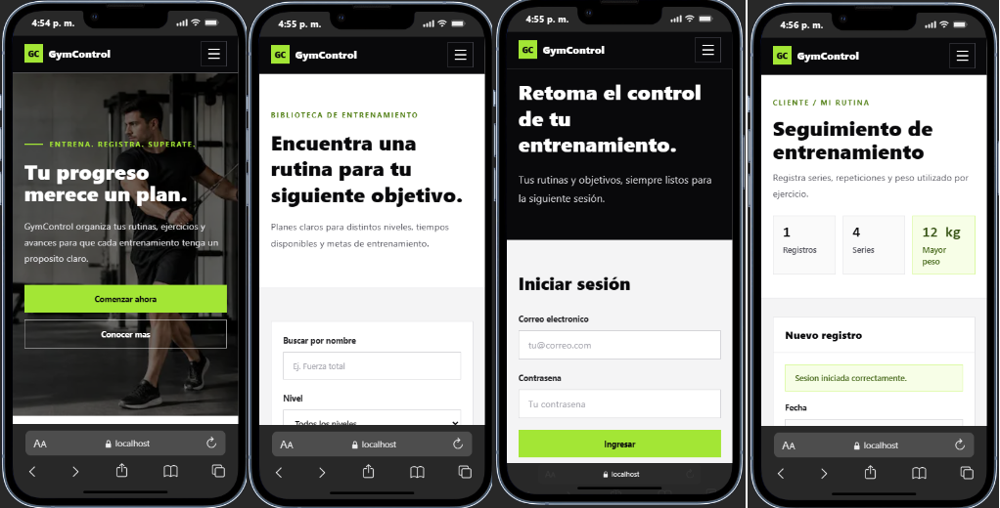

# GymControl

GymControl es una aplicacion web para administrar un gimnasio desde un panel privado y ofrecer una experiencia de consulta y seguimiento para clientes.

## Descripcion

El proyecto permite gestionar clientes, membresias, pagos, rutinas, ejercicios por rutina y registros de entrenamiento. Usa Supabase para autenticacion, base de datos PostgreSQL y Row Level Security, y Next.js App Router para renderizado del lado servidor, Server Components y Server Actions.

## Problema Que Resuelve

Muchos gimnasios pequenos gestionan clientes, pagos, membresias y rutinas en hojas de calculo o mensajes sueltos. GymControl centraliza esa informacion en una sola aplicacion:

- El OWNER administra la operacion del gimnasio.
- El CLIENT consulta su informacion privada.
- Los visitantes pueden revisar rutinas publicadas sin iniciar sesion.
- Los registros sensibles quedan protegidos con politicas RLS en Supabase.

## Funcionalidades

- Autenticacion con Supabase Auth.
- Registro e inicio de sesion.
- Navegacion publica con inicio, ejercicios y rutinas publicadas.
- Consumo de ejercicios desde una API externa.
- Panel OWNER en `/dashboard`.
- Administracion de clientes en `/dashboard/clientes`.
- Administracion de membresias en `/dashboard/membresias`.
- Administracion de pagos en `/dashboard/pagos`.
- CRUD de rutinas en `/dashboard/rutinas`.
- Publicacion de rutinas para visitantes.
- Configuracion de ejercicios dentro de cada rutina.
- Ordenamiento de ejercicios por posicion.
- Consulta publica de rutinas en `/rutinas`.
- Detalle publico de rutina en `/rutinas/[id]`.
- Consulta de membresia propia en `/mi-membresia`.
- Registro privado de entrenamiento en `/mi-rutina`.
- Visualizacion privada de progreso en `/mi-progreso`.
- Estados loading, error y not-found.
- Empty states en listados sin datos.
- Confirmacion antes de acciones destructivas.
- Validaciones de formularios en cliente y servidor.
- Feedback despues de Server Actions mediante mensajes de exito/error.
- Diseno responsive con Tailwind CSS.

## Roles

### OWNER

Puede administrar:

- Clientes.
- Membresias.
- Pagos.
- Rutinas.
- Ejercicios configurados dentro de rutinas.

Tambien puede publicar rutinas para que sean visibles sin autenticacion.

### CLIENT

Puede:

- Consultar su propio perfil.
- Consultar sus membresias.
- Consultar sus pagos.
- Registrar sus entrenamientos.
- Consultar su progreso.

No puede leer informacion privada de otros clientes.

### Visitante

Puede:

- Consultar la pagina publica de inicio.
- Consultar ejercicios externos.
- Consultar rutinas publicadas en `/rutinas`.
- Consultar el detalle de una rutina publicada en `/rutinas/[id]`.

## Stack Tecnologico

- Next.js 14.
- React 18.
- TypeScript.
- Tailwind CSS.
- Supabase Auth.
- Supabase PostgreSQL.
- Supabase Row Level Security.
- Server Components.
- Server Actions.
- Middleware de Next.js para sesion Supabase.
- wger API para consulta externa de ejercicios.

## Modelo De Datos

### `profiles`

Perfil de usuario vinculado a Supabase Auth.

| Campo            | Tipo aproximado | Descripcion                                  |
| ---------------- | --------------- | -------------------------------------------- |
| `id`             | `uuid`          | Primary key y referencia a `auth.users(id)`. |
| `role`           | `profile_role`  | `OWNER` o `CLIENT`.                          |
| `full_name`      | `text`          | Nombre completo.                             |
| `email`          | `text`          | Correo unico del perfil.                     |
| `avatar_url`     | `text`          | URL opcional de avatar.                      |
| `is_active`      | `boolean`       | Estado administrativo del cliente.           |
| `deactivated_at` | `timestamptz`   | Fecha de desactivacion.                      |
| `created_at`     | `timestamptz`   | Fecha de creacion.                           |
| `updated_at`     | `timestamptz`   | Fecha de ultima actualizacion.               |

### `memberships`

Membresias asociadas a clientes.

| Campo        | Tipo aproximado     | Descripcion                          |
| ------------ | ------------------- | ------------------------------------ |
| `id`         | `uuid`              | Primary key.                         |
| `client_id`  | `uuid`              | Cliente propietario de la membresia. |
| `plan_name`  | `text`              | Nombre del plan.                     |
| `status`     | `membership_status` | Estado de la membresia.              |
| `starts_at`  | `date`              | Fecha de inicio.                     |
| `ends_at`    | `date`              | Fecha de fin.                        |
| `price`      | `numeric(10,2)`     | Precio.                              |
| `currency`   | `char(3)`           | Moneda, por defecto `USD`.           |
| `created_at` | `timestamptz`       | Fecha de creacion.                   |
| `updated_at` | `timestamptz`       | Fecha de ultima actualizacion.       |

Estados esperados: `ACTIVE`, `PAUSED`, `EXPIRED`, `CANCELLED`.

### `payments`

Pagos relacionados con cliente y membresia.

| Campo            | Tipo aproximado  | Descripcion                                        |
| ---------------- | ---------------- | -------------------------------------------------- |
| `id`             | `uuid`           | Primary key.                                       |
| `client_id`      | `uuid`           | Cliente asociado al pago.                          |
| `membership_id`  | `uuid`           | Membresia pagada.                                  |
| `amount`         | `numeric(10,2)`  | Monto del pago.                                    |
| `currency`       | `char(3)`        | Moneda, por defecto `USD`.                         |
| `status`         | `payment_status` | Estado heredado del esquema inicial.               |
| `due_at`         | `date`           | Fecha de vencimiento heredada del esquema inicial. |
| `paid_at`        | `timestamptz`    | Fecha de pago heredada del esquema inicial.        |
| `payment_date`   | `date`           | Fecha operativa del pago.                          |
| `payment_method` | `text`           | Metodo de pago.                                    |
| `notes`          | `text`           | Notas o referencia.                                |
| `created_at`     | `timestamptz`    | Fecha de creacion.                                 |
| `updated_at`     | `timestamptz`    | Fecha de ultima actualizacion.                     |

El pago mantiene consistencia entre `client_id` y `membership_id` mediante una llave foranea compuesta hacia `memberships(id, client_id)`.

### `routines`

Rutinas creadas por usuarios OWNER.

| Campo              | Tipo aproximado     | Descripcion                        |
| ------------------ | ------------------- | ---------------------------------- |
| `id`               | `uuid`              | Primary key.                       |
| `owner_id`         | `uuid`              | Owner asociado al esquema inicial. |
| `created_by`       | `uuid`              | Creador autorizado de la rutina.   |
| `name`             | `text`              | Nombre de la rutina.               |
| `description`      | `text`              | Descripcion.                       |
| `objective`        | `routine_objective` | Objetivo de entrenamiento.         |
| `level`            | `routine_level`     | Nivel de dificultad.               |
| `duration_minutes` | `integer`           | Duracion estimada.                 |
| `is_published`     | `boolean`           | Visibilidad publica.               |
| `created_at`       | `timestamptz`       | Fecha de creacion.                 |
| `updated_at`       | `timestamptz`       | Fecha de ultima actualizacion.     |

Objetivos disponibles: `STRENGTH`, `HYPERTROPHY`, `WEIGHT_LOSS`, `CONDITIONING`.

Niveles disponibles: `BEGINNER`, `INTERMEDIATE`, `ADVANCED`.

### `routine_exercises`

Ejercicios configurados dentro de una rutina.

| Campo              | Tipo aproximado | Descripcion                |
| ------------------ | --------------- | -------------------------- |
| `id`               | `uuid`          | Primary key.               |
| `routine_id`       | `uuid`          | Rutina asociada.           |
| `name`             | `text`          | Nombre del ejercicio.      |
| `muscle_group`     | `text`          | Grupo muscular opcional.   |
| `equipment`        | `text`          | Equipamiento opcional.     |
| `sets`             | `integer`       | Series.                    |
| `reps`             | `text`          | Repeticiones.              |
| `suggested_weight` | `numeric(10,2)` | Peso sugerido opcional.    |
| `rest_seconds`     | `integer`       | Descanso en segundos.      |
| `position`         | `integer`       | Orden dentro de la rutina. |
| `created_at`       | `timestamptz`   | Fecha de creacion.         |

En la interfaz estos campos se presentan como `nombreEjercicio`, `series`, `repeticiones`, `pesoSugerido`, `descansoSegundos` y `orden`.

### `workout_logs`

Registros privados de entrenamiento creados por clientes.

| Campo                 | Tipo aproximado | Descripcion                            |
| --------------------- | --------------- | -------------------------------------- |
| `id`                  | `uuid`          | Primary key.                           |
| `client_id`           | `uuid`          | Cliente que registra el entrenamiento. |
| `routine_id`          | `uuid`          | Rutina usada.                          |
| `routine_exercise_id` | `uuid`          | Ejercicio realizado.                   |
| `performed_at`        | `timestamptz`   | Fecha del entrenamiento.               |
| `duration_minutes`    | `integer`       | Duracion tecnica con default.          |
| `completed`           | `boolean`       | Marca de completado.                   |
| `completed_sets`      | `integer`       | Series realizadas.                     |
| `completed_reps`      | `integer`       | Repeticiones realizadas.               |
| `used_weight`         | `numeric(10,2)` | Peso utilizado.                        |
| `notes`               | `text`          | Notas opcionales.                      |
| `created_at`          | `timestamptz`   | Fecha de creacion.                     |

Incluye restricciones para impedir valores negativos en series, repeticiones y peso utilizado.

## Relaciones Entre Tablas

- `profiles.id` referencia `auth.users.id`.
- `memberships.client_id` referencia `profiles.id`.
- `payments.client_id` referencia `profiles.id`.
- `payments.membership_id` referencia `memberships.id`.
- `payments(membership_id, client_id)` referencia `memberships(id, client_id)` para garantizar que el pago pertenezca a la membresia del mismo cliente.
- `routines.owner_id` referencia `profiles.id`.
- `routines.created_by` referencia `profiles.id`.
- `routine_exercises.routine_id` referencia `routines.id`.
- `workout_logs.client_id` referencia `profiles.id`.
- `workout_logs.routine_id` referencia `routines.id`.
- `workout_logs.routine_exercise_id` referencia `routine_exercises.id`.
- `workout_logs(routine_exercise_id, routine_id)` referencia `routine_exercises(id, routine_id)` para mantener la relacion correcta entre rutina y ejercicio.

## Seguridad Y RLS

El proyecto usa Row Level Security real en Supabase. Las politicas estan en `supabase/migrations/20260824010000_harden_rls_policies.sql`.

Reglas principales:

- CLIENT puede leer y editar su propio `profile`.
- CLIENT puede consultar sus propias `memberships`.
- CLIENT puede consultar sus propios `payments`.
- CLIENT puede crear y consultar sus propios `workout_logs`.
- CLIENT no puede leer datos privados de otros clientes.
- OWNER puede administrar clientes, membresias, pagos y rutinas.
- Solo el creador OWNER autorizado puede modificar sus rutinas y ejercicios.
- Las rutinas publicadas y sus ejercicios pueden consultarse sin autenticacion.

## API Externa Utilizada

GymControl consume la API publica de wger para mostrar ejercicios:

- Endpoint: `https://wger.de/api/v2/exerciseinfo/?limit=24&language=4`
- Uso: listado publico de ejercicios en `/ejercicios`.
- Archivo principal: `lib/external-exercises.ts`.
- Estrategia: validacion manual del payload, normalizacion de descripcion y seleccion de imagen principal cuando existe.

## Estructura Del Proyecto

```txt
app/
  auth/                 Server Actions de autenticacion
  dashboard/            Panel privado OWNER
    clientes/           Administracion de clientes
    membresias/         Administracion de membresias
    pagos/              Administracion de pagos
    rutinas/            CRUD de rutinas y ejercicios
  ejercicios/           Consulta publica de ejercicios externos
  login/                Inicio de sesion
  mi-membresia/         Vista privada de membresia del CLIENT
  mi-progreso/          Progreso privado del CLIENT
  mi-rutina/            Registro privado de entrenamientos
  register/             Registro de usuarios
  rutinas/              Rutinas publicas
components/             Componentes reutilizables de UI
lib/
  auth/                 Sesion, permisos y rutas protegidas
  clients/              Consultas de clientes
  memberships/          Consultas de membresias
  payments/             Consultas de pagos
  routines/             Consultas de rutinas
  supabase/             Clientes Supabase server/client/middleware
  workouts/             Consultas de entrenamiento y progreso
supabase/migrations/    Migraciones SQL y politicas RLS
types/                  Tipos compartidos
public/images/          Assets publicos
```

## Instalacion

Clona el repositorio e instala dependencias:

```bash
git clone https://github.com/SantyTM21/GymControl.git
cd GymControl
npm install
```

## Variables De Entorno

Crea un archivo `.env.local` en la raiz del proyecto. No coloques secretos reales en el README ni los subas al repositorio.

```env
NEXT_PUBLIC_SUPABASE_URL=<TU_SUPABASE_URL>
NEXT_PUBLIC_SUPABASE_PUBLISHABLE_KEY=<TU_SUPABASE_PUBLISHABLE_KEY>
```

El archivo `.env.example` contiene los nombres de variables requeridas sin valores reales.

## Base De Datos

Aplica las migraciones ubicadas en `supabase/migrations` sobre tu proyecto Supabase.

Orden actual:

```txt
20260817000000_initial_schema.sql
20260818000000_create_profile_on_signup.sql
20260818010000_role_policies.sql
20260819000000_client_admin_fields.sql
20260819010000_membership_status_cancelled.sql
20260820000000_payments_module_fields.sql
20260820010000_routines_crud_publish.sql
20260821000000_routine_exercises_fields.sql
20260824000000_client_workout_tracking.sql
20260824010000_harden_rls_policies.sql
```

## Ejecucion Local

Inicia el servidor de desarrollo:

```bash
npm run dev
```

Luego abre:

```txt
http://localhost:3000
```

## Credenciales De Prueba

El repositorio incluye usuarios y contrasenas de prueba en Supabase Auth con el rol correspondiente.

| Rol    | Email sugerido                 | Password     |
| ------ | ------------------------------ | ------------ |
| OWNER  | `owner.demo@gymcontrol.local`  | `123Admin+`  |
| CLIENT | `client.demo@gymcontrol.local` | `123Member+` |

## Capturas de pantalla

### Inicio



### Dashboard OWNER



### Pagos



### Rutinas públicas



### Mi progreso



### Modo responsivo



## Enlace De Vercel

```txt
https://gym-control-six.vercel.app
```

## Enlace Del Video

```txt
<Proximamente>
```

## Autor

```txt
<Ronald Trujillo - SantyTM21(github)>
```

## Checklist De Requisitos Cumplidos

- [x] Proyecto con Next.js, React y TypeScript.
- [x] Estilos con Tailwind CSS.
- [x] Autenticacion con Supabase.
- [x] Roles `OWNER` y `CLIENT`.
- [x] Panel privado para OWNER.
- [x] Gestion de clientes.
- [x] Gestion de membresias.
- [x] Gestion de pagos.
- [x] CRUD de rutinas mediante Server Actions.
- [x] Publicacion de rutinas.
- [x] Consulta publica de rutinas publicadas.
- [x] Detalle publico de rutina.
- [x] Configuracion de ejercicios por rutina.
- [x] Ejercicios ordenados dentro de rutina.
- [x] Seguimiento de entrenamiento para CLIENT.
- [x] Validaciones para impedir pesos, repeticiones y series negativas.
- [x] Vista `/mi-progreso` con historial y evolucion simple.
- [x] Separacion de componente interactivo en progreso.
- [x] CRUD y mutaciones mediante Server Actions.
- [x] Uso de `revalidatePath` despues de crear, actualizar o eliminar cuando aplica.
- [x] Row Level Security real en Supabase.
- [x] Rutinas publicadas visibles sin autenticacion.
- [x] Proteccion de datos privados por usuario.
- [x] Estados loading.
- [x] Mensajes de error.
- [x] Paginas not-found.
- [x] Empty states.
- [x] Confirmacion antes de eliminar.
- [x] Feedback despues de Server Actions.
- [x] Diseno responsive.
- [x] Sin uso de `any` en `app`, `components`, `lib` y `types`.
